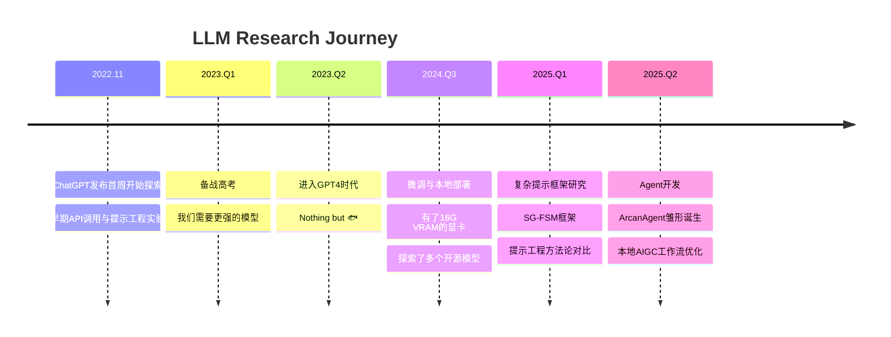
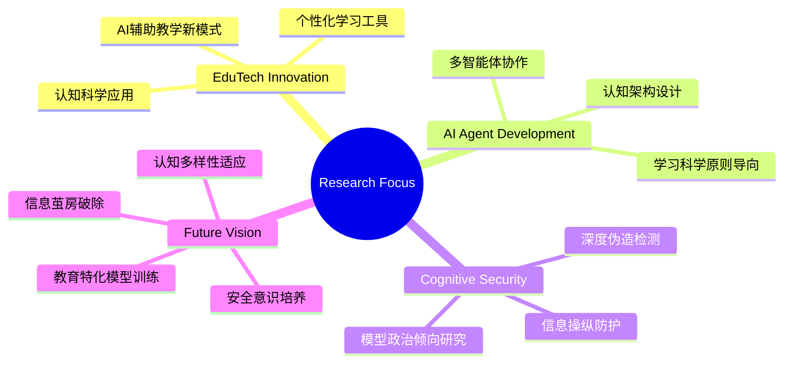

# 苏心贤 - 憧憬成为educator的learner 👨‍🎓

<div align="center">


[](https://github.com/FinnClair-Su)
[](https://fcus.dev)
[](mailto:kanade271828@gmail.com)
[](https://huggingface.co/Knd271828)


</div>

## 👨‍💻 关于我

<table>
<tr>
<td width="60%">

🎓 **学术背景**
- 北京交通大学直博生
- 本科：计算机科学 | 博士：网络安全
- 目前处于大二到大三的暑假阶段

🔬 **研究方向**
- 软件供应链漏洞Agent检测
- 多元文化背景下的LLM自监督学习
- Learning Science & EduTech融合创新

🌟 **研究理念**
> *"技术应当服务于人类认知的自然发展，教育关系应当顺应教育技术的发展。"*
>
> *Flowing Code, Structured Universe* - 让代码如流水般自然，让宇宙如结构般有序

</td>
<td width="40%">

```python
class SuXinxian:
    def __init__(self):
        self.name = "苏心贤"
        self.role = "Educator-to-be Learner"
        self.university = "BJTU"
        self.interests = [
            "Learning Science",
            "AI Agent Development", 
            "Cognitive Security",
            "Educational Technology"
        ]
        self.motto = "Meta cognition, Desirable difficulty"
    
    def current_focus(self):
        return {
            "research": ["Supply Chain Security", "LLM Self-Supervision"],
            "passion": ["EduTech Innovation", "AI Safety"],
            "exploration": ["Cognitive Security", "LLM Ethics"]
        }
```

</td>
</tr>
</table>

## 🛠️ 技术栈与能力图谱

<div align="center">

### 💻 编程语言


### 🤖 AI/ML 技术栈


### 🔧 开发工具与环境


### ☁️ 云服务与部署


</div>

## 🚀 精选项目展示

<div align="center">
<table>
<tr>
<td width="50%">

### 🔗 ArcanAgent
*Bidirectional Linking is All You Need*

<a href="https://github.com/FinnClair-Su/ArcanAgent">

</a>

**🧠 核心创新**
- 纯Markdown双向链接系统取代复杂图数据库
- 22个大阿卡纳主题认知智能体
- 维果茨基ZPD理论与认知负荷理论实践
- FSRS间隔重复算法集成

**🌟 技术亮点**
- 零数据库依赖的知识管理
- MCP协议智能体通信
- Obsidian无缝兼容
- 认知科学驱动的学习路径规划

</td>
<td width="50%">

### 📝 XYY-Diary Template
*Academic Blog with ASCII Art*

<a href="https://github.com/FinnClair-Su/xyy-diary-template">

</a>

**✨ 特色功能**
- 多分区博客组织（学习、技术、生活）
- 独特ASCII动画计数器
- 响应式设计与深色模式
- 一键部署到多平台

**🎨 设计理念**
- 学习进度可视化
- 技术怀旧风格
- 内容分类管理
- SEO优化布局

</td>
</tr>
</table>
</div>

## 🔬 LLM研究历程与实践深度

<details>
<summary><b>🎯 点击展开我的LLM探索之路</b></summary>

### 📅 时间线式发展轨迹


</details>

## 🏗️ 高性能研究环境

<div align="center">
<table>
<tr>
<td width="33%">

### 💻 工作站配置
```yaml
CPU: 7800X3D
Memory: 64GB DDR5
GPU: RTX 4080S (16GB VRAM)
Storage: Seagate 530
And MacBook & Mac mini
OS: macOS + Windows + Linux
```

</td>
<td width="33%">

### 🖥️ 服务器环境
```yaml
Device: Mac Mini M4
Network: 公网IPv4/IPv6
Services: 持续部署服务
Usage: 轻量服务托管
Uptime: 24/7可用性
```

</td>
<td width="33%">

### ☁️ 云资源矩阵
```yaml
API_Services:
  - OpenRouter (多模型接入)
  - SiliconFlow (国产模型)
  - Google Cloud (企业级)
Payment: 国际支付能力
Budget: 可持续投入
```

</td>
</tr>
</table>
</div>

## 🎯 研究兴趣与未来愿景

<div align="center">



</div>

### 🌟 长期目标
- 🎓 **教育AI模型**: 训练类似Google LearnLM的教育特化模型
- 🧠 **个性化工具**: 构建适应学生认知多样性的AI学习助手  
- 🛡️ **认知安全**: 破除信息茧房，保护认知安全
- 👨‍🏫 **培养新一代**: 培养具备认知科学知识的下一代学习者

## 📊 GitHub 数据洞察

<div align="center">


</div>

<div align="center">


</div>

<div align="center">


</div>

## 🤝 学术合作与交流

<div align="center">

| 维度 | 详情 | 联系方式 |
|------|------|----------|
| 📧 **学术邮箱** | 研究合作与讨论 | [kanade271828@gmail.com](mailto:kanade271828@gmail.com) |
| 🤗 **开源平台** | 模型与数据集分享 | [@Knd271828](https://huggingface.co/Knd271828) |
| 🐙 **代码协作** | 开源项目贡献 | [FinnClair-Su](https://github.com/FinnClair-Su) |
| 🌐 **个人网站** | 一些博客和个人生活感悟 | [fcus.dev](https://fcus.dev) |

</div>

---

<div align="center">

### 💭 Meta Cognition | 🎯 Desirable Difficulty

*"在认知的元层面思考学习，在适宜的困难中寻求成长"*


**感谢您的关注！期待与您在学习科学与AI的交汇点相遇 🚀**

</div>
